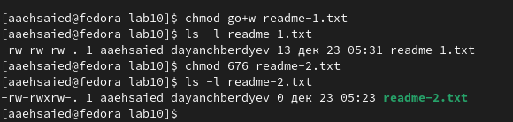

---
## Front matter
title: "Отчет по лабораторной работе №10"
subtitle: "Архитектура компьютера"
author: "Элсаиед Адел"

## Generic otions
lang: ru-RU
toc-title: "Содержание"

## Bibliography
bibliography: bib/cite.bib
csl: pandoc/csl/gost-r-7-0-5-2008-numeric.csl

## Pdf output format
toc: true # Table of contents
toc-depth: 2
lof: true # List of figures
lot: true # List of tables
fontsize: 12pt
linestretch: 1.5
papersize: a4
documentclass: scrreprt
## I18n polyglossia
polyglossia-lang:
  name: russian
  options:
	- spelling=modern
	- babelshorthands=true
polyglossia-otherlangs:
  name: english
## I18n babel
babel-lang: russian
babel-otherlangs: english
## Fonts
mainfont: PT Serif
romanfont: PT Serif
sansfont: PT Sans
monofont: PT Mono
mainfontoptions: Ligatures=TeX
romanfontoptions: Ligatures=TeX
sansfontoptions: Ligatures=TeX,Scale=MatchLowercase
monofontoptions: Scale=MatchLowercase,Scale=0.9
## Biblatex
biblatex: true
biblio-style: "gost-numeric"
biblatexoptions:
  - parentracker=true
  - backend=biber
  - hyperref=auto
  - language=auto
  - autolang=other*
  - citestyle=gost-numeric
## Pandoc-crossref LaTeX customization
figureTitle: "Рис."
tableTitle: "Таблица"
listingTitle: "Листинг"
lofTitle: "Список иллюстраций"
lotTitle: "Список таблиц"
lolTitle: "Листинги"
## Misc options
indent: true
header-includes:
  - \usepackage{indentfirst}
  - \usepackage{float} # keep figures where there are in the text
  - \floatplacement{figure}{H} # keep figures where there are in the text
---

# Цель работы 

Приобретение навыков написания программ для работы с файлами.

# Лабораторная работа

***Шаг 1***

С помощью утилиты mkdir создаю директорию lab10, перехожу в нее и создаю
файл для работы.

{#fig:001 width=70%}

***Шаг 2***

Открываю созданный файл lab10-1.asm, вставляю в него программу из Листинга

{#fig:001 width=70%}

***Шаг 3***

Создаю исполняемый файл программы, а также сам файл, куда будет записываться строка.

{#fig:001 width=70%}

***Шаг 4***

С помощью команды chmod изменяю права доступа к исполняемому файлу
lab10-1, запретив его выполнение.

{#fig:001 width=70%}

***Шаг 5***

В соответствии со своим 20-ым вариантом в таблице, предоставляю права доступа к файлу readme-1.txt представленные в символьном виде: --- rw- -w- 

{#fig:001 width=70%}

***Шаг 6***

Предоставляю права доступа к файлу readme-2.txt представленные в символьном – в двочном виде: 001 011 111, то есть 1 3 7

{#fig:001 width=70%}

# Самостоятельная работа

***Шаг 1***

Создаю новый файлы для самостояльной работы

{#fig:001 width=70%}

***Шаг 2***

Пишу в неё текст программы, которая будет запрашивать имя пользователя, будет создавать файл и записывать в нее введенное имя, добавив в начале текст : “Меня зовут”.

{#fig:001 width=70%}

***Шаг 3***

Создаю исполняемый файл и запускаю её, ввожу свое имя и фамилию.
С помощью атрибуты cat проверяю содержимое созданного файла.

{#fig:001 width=70%}

## Программа отработала корректно!!

# Выводы

В ходе выполениния работы были получены навыки по работе с файлами в
NASM.

::: {#refs}
:::
